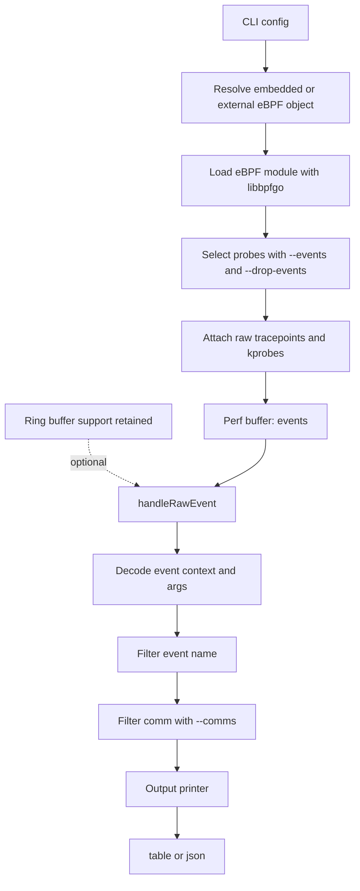
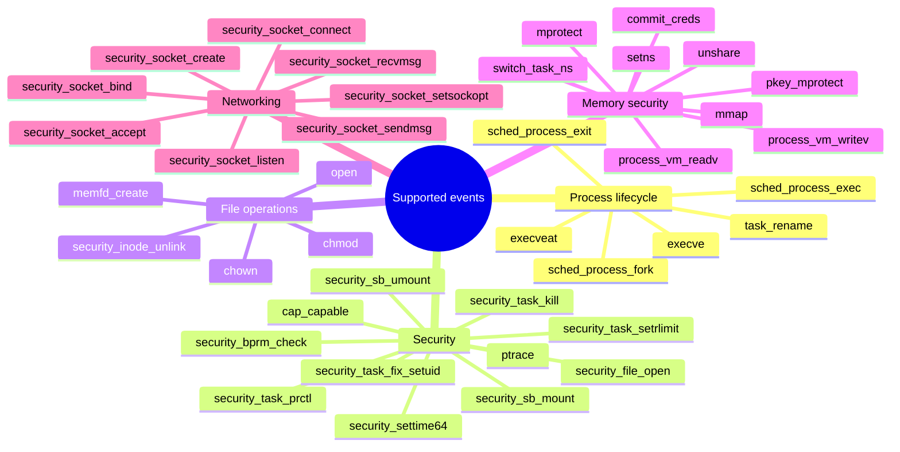
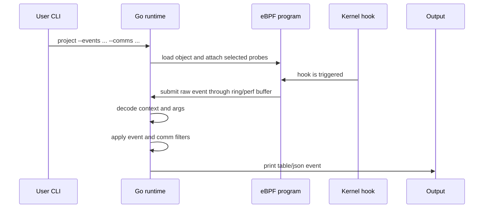

# Project demo notes

## Goal

This demo shows the current end-to-end pipeline:

- selected kernel hooks are attached from Go;
- active hooks send events through the perf buffer;
- ring buffer support remains available for fallback and experiments;
- userspace decodes raw bytes into structured events;
- filters reduce noise;
- output is printed as `table` or `json`.

This is not yet a detection engine. The goal of the demo is to show that the
event collection pipeline works and that the architecture is ready for
enrichment and detection logic.

## Current Pipeline



## What Works Today

- eBPF object build through `make bpf`.
- Go userspace runtime based on `libbpfgo`.
- Probe registry in `pkg/ebpf/probes`.
- Event selection with `--events` and `--drop-events`.
- Command-name filtering with `--comms`.
- Perf buffer as the current event transport.
- Ring buffer support retained for future fallback or comparison.
- Output layer with `json` and `table`.

## Event Groups



## Demo Flow

### 1. Build the Tool

```bash
cd demo_project
make build
```

Expected result:

```text
dist/project.bpf.o
dist/project
```

### 2. Show Process Execution Events

Terminal 1:

```bash
sudo ./dist/project \
  --events task_rename,sched_process_exec,sched_process_exit \
  --comms ls,whoami \
  --output table
```

Terminal 2:

```bash
ls
whoami
```

Expected output shape:

```text
event=task_rename pid=... tid=... uid=1000 comm=bash args=old_name=bash,new_name=ls
event=sched_process_exec pid=... tid=... uid=1000 comm=ls args=filename=/usr/bin/ls
event=sched_process_exit pid=... tid=... uid=1000 comm=ls args=exit_code=0,group_dead=1
```

What to explain:

- `task_rename` shows the task `comm` transition.
- `sched_process_exec` shows the executed binary path.
- `sched_process_exit` shows process termination and exit code.
- `--comms` keeps the output focused on the commands used in the demo.

### 3. Show Networking Event Path

Terminal 1:

```bash
make filtered
```

Terminal 2:

```bash
python3 -m http.server 18080 --bind 127.0.0.1
```

Terminal 3:

```bash
curl http://127.0.0.1:18080
```

What to explain:

- `security_socket_connect` is attached as a kprobe.
- Networking hooks currently follow the perf-buffer path.
- The runtime now reads both ring buffer and perf buffer.

### 4. Optional: Show a Sensitive Security Hook

Terminal 1:

```bash
sudo ./dist/project --events security_settime64 --output table
```

Terminal 2:

```bash
sudo date -s "$(date '+%Y-%m-%d %H:%M:%S')"
```

What to explain:

- `security_settime64` is triggered when a process tries to modify system time.
- It requires privileges such as `CAP_SYS_TIME`.
- Use this only on a test VM.

### 5. Show Namespace and Filesystem Events

Terminal 1:

```bash
sudo ./dist/project \
  --events switch_task_ns,security_sb_mount,security_sb_umount,security_inode_unlink \
  --output table
```

Terminal 2:

```bash
sudo unshare -m true
sudo mkdir -p /tmp/project-mount-test
sudo mount -t tmpfs -o nosuid,nodev tmpfs /tmp/project-mount-test
sudo umount /tmp/project-mount-test
sudo rmdir /tmp/project-mount-test
touch /tmp/project-unlink-test
rm /tmp/project-unlink-test
```

What to explain:

- `setns` and `unshare` describe syscall requests and results.
- `switch_task_ns` reports the namespace IDs actually replaced by the kernel.
- mount and unlink hooks expose kernel-resolved paths and filesystem metadata.
- these security hooks describe the kernel validation point and do not include
  the final syscall return value.

## Architecture Talking Points



Key points:

- The tool does not attach every probe blindly when `--events` is used.
- The decoder is intentionally separated from output formatting.
- The output layer can evolve without changing the eBPF runtime.
- The current design is close to Tracee conceptually, but smaller and easier to
  reason about for the thesis.

## Known Limits

- Some arguments are still raw numeric values.
- `security_task_prctl` needs symbolic mapping for options like `PR_SET_VMA`.
- Socket addresses and socket constants need better human-readable formatting.
- `--comms` is a userspace filter, so it improves output readability but does
  not reduce kernel-side work.
- Perf buffer is the current transport; ring buffer support is retained but is
  not used by the active hooks.
- Detection logic and MITRE ATT&CK mapping are future work.

## Short Closing

The current version demonstrates the hard part of the project: a working
kernel-to-userspace event pipeline on the target Rocky Linux kernel. The next
step is not loading eBPF anymore, but improving event semantics: better
argument mapping, stronger filters and eventually detection logic.
