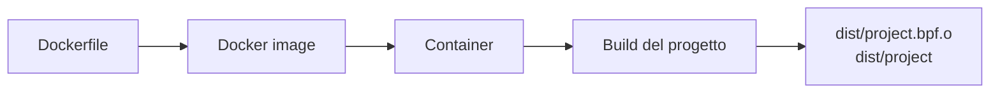
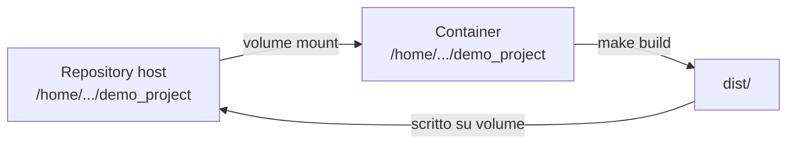
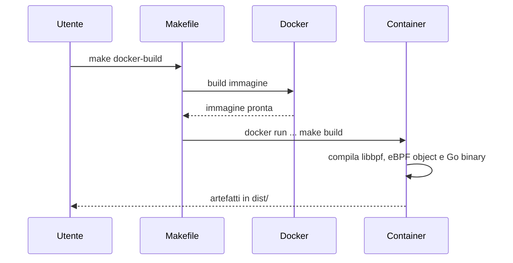
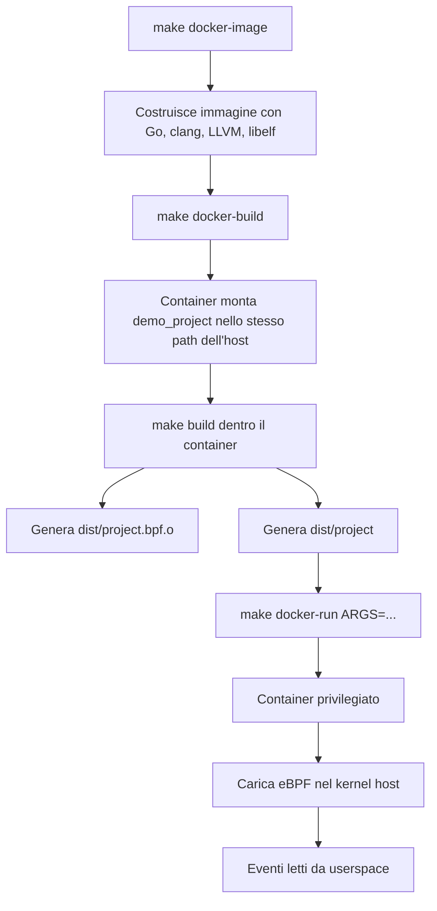

# Docker nel progetto

Questo documento spiega in modo semplice come Docker entra nel nostro progetto,
perché lo stiamo usando e quali problemi risolve davvero.

L'idea importante da tenere a mente è questa: Docker ci aiuta soprattutto a
rendere riproducibile l'ambiente di build. Per l'esecuzione eBPF, invece, il
tool continua a dipendere dal kernel della macchina host.

## Il problema che Docker risolve

Il nostro tool ha dipendenze abbastanza specifiche:

- Go e CGO;
- `clang` e LLVM per compilare il codice eBPF;
- `make`;
- `pkg-config`;
- header e librerie per `libelf` e `zlib`;
- `libbpfgo` e il codice sorgente di `libbpf`;
- un kernel Linux con BTF disponibile.

Installare e allineare tutte queste dipendenze manualmente su ogni macchina è
scomodo. Inoltre, branch diversi possono richiedere piccoli cambiamenti
nell'ambiente. Docker ci permette di descrivere questo ambiente in un file,
il `Dockerfile`, e ricostruirlo in modo prevedibile.

In pratica, invece di dire:

> installa questi pacchetti, usa questa versione di Go, assicurati che clang
> sia presente, controlla pkg-config, poi prova a compilare

possiamo dire:

```bash
make docker-build
```

e lasciare che Docker prepari l'ambiente di compilazione.

## Immagine e container

Docker introduce due concetti principali: immagine e container.

L'immagine è il template. Nel nostro caso contiene Go, clang, LLVM e le librerie
necessarie per compilare il progetto.

Il container è un processo avviato a partire da quell'immagine. Quando lanciamo
un target come `make docker-build`, Docker crea un container temporaneo, monta
la repository dentro il container e compila il progetto.



Nel nostro caso l'immagine viene costruita con:

```bash
make docker-image
```

Questo target usa il `Dockerfile` in `demo_project/Dockerfile`.

## Cosa contiene il Dockerfile

Il Dockerfile parte da un'immagine ufficiale Go:

```dockerfile
FROM golang:1.22-bookworm
```

Poi installa i pacchetti necessari alla build:

```dockerfile
clang
gcc
git
libc6-dev
libelf-dev
llvm
make
pkg-config
zlib1g-dev
```

Questi pacchetti sono quelli che normalmente installeremmo a mano sulla VM.
Docker li mette dentro l'immagine, così la build non dipende più dallo stato
della macchina locale.

## Come entra il codice nel container

Il codice non viene copiato dentro l'immagine. Viene montato al momento
dell'esecuzione del container.

Nel Makefile questo avviene con:

```make
DOCKER_WORKDIR ?= $(CURDIR)
DOCKER_MOUNT = -v $(CURDIR):$(DOCKER_WORKDIR) -w $(DOCKER_WORKDIR)
```

Significa:

- monta la directory corrente del progetto dentro il container;
- rendila visibile nello stesso path assoluto usato sull'host;
- usa quel path come working directory.

Usare lo stesso path dell'host evita un problema sottile: alcuni file generati
da `libbpf` e `pkg-config` contengono path assoluti. Se il progetto venisse
montato in un path diverso, per esempio `/src`, quei path potrebbero puntare a
directory inesistenti dentro il container.

Quindi, quando il container esegue `make build`, sta compilando il codice reale
della repository locale.



Questo è utile perché gli artefatti generati restano disponibili sulla macchina
host:

```text
demo_project/dist/project.bpf.o
demo_project/dist/project
```

## Build del progetto con Docker

Il target principale per compilare è:

```bash
make docker-build
```

Internamente fa due cose:



Dentro il container viene eseguito:

```bash
make build
```

Quindi il comportamento è lo stesso della build locale, ma con dipendenze
controllate da Docker.

## Perché usiamo `--network=host` durante la build

Nel nostro Makefile sia `docker-image` sia `docker-build` usano la rete host.
Il primo ne ha bisogno per `apt-get update`, il secondo per scaricare eventuali
moduli Go mancanti.

Il target `docker-image` usa:

```bash
docker build --network=host -t demo-project-ebpf:dev .
```

Questo è stato aggiunto perché sulla VM il container di build non riusciva a
risolvere `deb.debian.org` durante `apt-get update`.

L'errore era simile a:

```text
Temporary failure resolving 'deb.debian.org'
Unable to locate package clang
```

Con `--network=host`, Docker usa la rete dell'host durante la fase di build.
Su una VM Linux questo è spesso il modo più semplice per evitare problemi DNS
specifici del bridge Docker.

Lo stesso principio vale per `docker-build`: se Go deve scaricare un modulo da
`proxy.golang.org`, il container usa la stessa rete dell'host.

Se non serve, si può tornare al comportamento standard:

```bash
make docker-image DOCKER_BUILD_NETWORK=default
```

## Esecuzione del tool con Docker

Compilare in Docker è semplice. Eseguire un tool eBPF in Docker richiede invece
più attenzione.

Il motivo è che un container non ha un kernel separato. Usa il kernel della
macchina host. Quindi, quando il nostro binario carica programmi eBPF, li sta
caricando nel kernel reale della VM.

Per questo il target:

```bash
make docker-run ARGS="--events sched_process_exec --output table"
```

usa opzioni più forti:

```bash
--privileged
--pid=host
-v /sys/kernel/btf:/sys/kernel/btf:ro
-v /sys/fs/bpf:/sys/fs/bpf
```

Queste opzioni servono a dare al container accesso alle parti del sistema
necessarie per eBPF.

```mermaid
flowchart TB
    subgraph Host["VM host"]
        K[Kernel Linux<br/>eBPF verifier, hooks, maps]
        BTF[/sys/kernel/btf/vmlinux]
        BPFFS[/sys/fs/bpf]
    end

    subgraph Container["Container Docker"]
        P[dist/project]
    end

    P -->|carica programmi eBPF| K
    P -->|legge BTF| BTF
    P -->|usa bpffs| BPFFS
```

Questa è la differenza fondamentale rispetto a una normale applicazione Docker:
il nostro tool non osserva solo il container, ma il kernel host.

## Cosa fanno le opzioni di runtime

`--privileged` dà al container privilegi sufficienti per caricare programmi eBPF
e interagire con risorse del kernel. Senza questa opzione, il caricamento degli
hook eBPF fallirebbe quasi sicuramente.

`--pid=host` fa vedere al container il namespace dei processi dell'host. Questo
è importante perché il tool osserva eventi di sistema e processi reali della VM.

Il mount di `/sys/kernel/btf` rende disponibile il file BTF del kernel. Questo
serve per CO-RE, cioè per permettere al codice eBPF di adattarsi alle strutture
kernel della macchina su cui gira.

Il mount di `/sys/fs/bpf` rende disponibile il filesystem BPF. È utile per mappe
e oggetti BPF gestiti dal kernel.

## Cosa Docker non risolve

Docker non cambia il kernel.

Se la VM usa:

```text
Linux 4.18.0-553.109.1.el8_10.x86_64
```

il tool continuerà a girare su quel kernel, anche dentro Docker.

Questo significa che restano validi i limiti del kernel host:

- helper eBPF disponibili;
- comportamento del verifier;
- supporto a ring buffer o perf buffer;
- disponibilità e qualità del BTF;
- differenze dovute ai backport Rocky/RHEL.

Docker rende più stabile la build, ma non rende più moderno il kernel.

## Flusso completo nel nostro progetto

Il flusso completo è questo:



## Quando conviene usare Docker

Docker conviene quando:

- una macchina non ha ancora tutte le dipendenze installate;
- vogliamo evitare differenze tra ambienti di sviluppo;
- vogliamo una build ripetibile per demo o test;
- dobbiamo collaborare su branch diversi senza rincorrere pacchetti mancanti;
- vogliamo isolare l'ambiente di compilazione dal sistema host.

Per lo sviluppo quotidiano sulla VM già configurata, la build locale può essere
più veloce:

```bash
make build
```

Per una demo o per riallineare l'ambiente, Docker è più prevedibile:

```bash
make docker-build
```

## Limiti pratici

Docker aggiunge un po' di overhead: la prima build dell'immagine può essere
lenta perché scarica l'immagine base e installa i pacchetti Debian.

Inoltre, se la rete Docker o il DNS della VM non sono configurati bene,
`apt-get update` può fallire durante `docker build`. Per questo nel Makefile
usiamo `--network=host` di default.

Infine, `make docker-run` richiede privilegi elevati. È normale per un tool eBPF,
ma significa che va usato solo in un ambiente controllato, come la nostra VM di
test.

## Riassunto

Docker nel nostro progetto serve principalmente a rendere la build più
riproducibile.

La compilazione avviene dentro un container con dipendenze controllate. Gli
artefatti vengono scritti nella directory locale `dist/`.

L'esecuzione, invece, resta legata al kernel host: il container lancia il nostro
binario, ma gli hook eBPF vengono caricati nella VM reale. Per questo servono
privilegi, BTF e accesso a `/sys/fs/bpf`.

In una frase: Docker standardizza l'ambiente userspace, ma il comportamento eBPF
dipende ancora dal kernel della macchina su cui stiamo osservando gli eventi.
