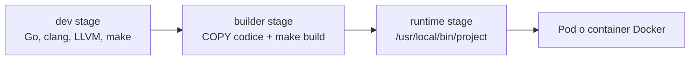
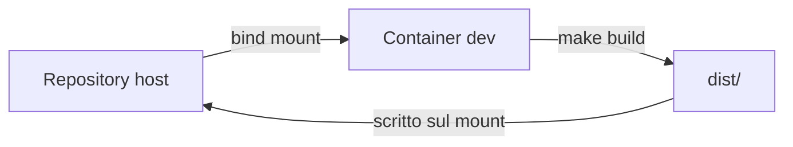

# Docker nel progetto

Docker nel progetto ha due usi distinti: ci dà un ambiente di sviluppo
riproducibile e ci permette di produrre una vera immagine runtime del tool.
Questa distinzione è importante perché il progetto non deve solo compilare
localmente: in prospettiva deve poter girare anche dentro un pod Kubernetes.

Il punto chiave è questo: Docker standardizza lo userspace, quindi Go, clang,
LLVM, libelf, zlib e il binario finale. Non cambia però il kernel. Quando il
tool gira in container, i programmi eBPF vengono comunque caricati nel kernel
del nodo host.

## Perché lo usiamo

Il tool richiede dipendenze abbastanza specifiche:

- Go e CGO;
- `clang` e LLVM per compilare il codice eBPF;
- `make`;
- `pkg-config`;
- header e librerie per `libelf` e `zlib`;
- `libbpfgo` e il codice sorgente di `libbpf`;
- un kernel Linux con BTF disponibile.

Senza Docker, ogni macchina deve avere queste dipendenze installate e allineate
a mano. Con Docker descriviamo l'ambiente nel `Dockerfile` e lo ricostruiamo in
modo prevedibile.

## Due immagini logiche

Il Dockerfile è organizzato in più stage:

- `dev`: contiene toolchain e dipendenze di build;
- `builder`: copia il codice del progetto e compila il binario;
- `runtime`: contiene solo le librerie runtime e il binario `project`.



Questa struttura risolve il problema che avevamo all'inizio: l'immagine non era
veramente applicativa, perché il codice entrava solo tramite bind mount. Ora
l'immagine runtime contiene già il tool compilato.

## Immagine runtime

Il target:

```bash
make docker-image
```

costruisce lo stage `runtime` e produce, di default:

```text
demo-project-ebpf:runtime
```

Su un checkout appena clonato bisogna prima eseguire:

```bash
make init
```

Il motivo è semplice: il Dockerfile copia il contenuto già presente nella
working tree. Siccome `.git` non entra nel build context, il container non può
inizializzare i submodule al posto nostro.

Dentro questa immagine viene installato:

```text
/usr/local/bin/project
```

e viene copiato anche l'oggetto eBPF compilato:

```text
/opt/project/project.bpf.o
```

Il binario Go usa normalmente l'oggetto eBPF embedded, quindi non dipende da un
volume montato con la repository. Questo rende l'immagine adatta a scenari come
Docker runtime o Kubernetes.

```mermaid
flowchart TD
    A[Repository locale] --> B[docker build --target runtime]
    B --> C[Compila libbpf, eBPF object e Go binary]
    C --> D[Immagine runtime]
    D --> E[/usr/local/bin/project]
```

## Immagine di sviluppo

Per lo sviluppo locale resta disponibile lo stage `dev`. Viene usato da:

```bash
make docker-build
make docker-shell
```

`make docker-build` compila il progetto dentro un container con toolchain
controllata, ma monta la repository dal filesystem host. Gli artefatti vengono
scritti nella directory locale:

```text
demo_project/dist/project.bpf.o
demo_project/dist/project
```

Questo comportamento è utile durante lo sviluppo perché permette di modificare
il codice sull'host e compilare dentro un ambiente pulito senza creare ogni
volta una nuova immagine runtime.



`make docker-shell` apre invece una shell interattiva nello stesso ambiente:

```bash
make docker-shell
```

È utile per debug di build, `pkg-config`, `clang`, `go env` e dipendenze.

## Esecuzione da Docker

Il target:

```bash
make docker-run ARGS="--events sched_process_exec --output table"
```

usa l'immagine runtime e avvia direttamente `project`. Non monta più la
repository nel container, perché il binario è già dentro l'immagine.

Per eseguire eBPF servono comunque privilegi e accesso ad alcune risorse del
nodo:

```bash
--privileged
--pid=host
-v /sys/kernel/btf:/sys/kernel/btf:ro
-v /sys/fs/bpf:/sys/fs/bpf
```

Queste opzioni servono perché il container non ha un kernel proprio. Il tool
sta osservando il kernel reale della macchina host.

```mermaid
flowchart TB
    subgraph Host["Nodo host"]
        K[Kernel Linux<br/>verifier, hooks, BPF maps]
        BTF[/sys/kernel/btf/vmlinux]
        BPFFS[/sys/fs/bpf]
    end

    subgraph Container["Container runtime"]
        P[/usr/local/bin/project]
    end

    P -->|carica programmi eBPF| K
    P -->|legge BTF| BTF
    P -->|usa bpffs| BPFFS
```

## Implicazioni per Kubernetes

In Kubernetes l'immagine runtime può essere usata direttamente in un pod. La
forma più naturale, se vogliamo osservare tutti i nodi, è un DaemonSet: un pod
per ogni nodo.

Un esempio minimale di configurazione runtime è:

```yaml
apiVersion: apps/v1
kind: DaemonSet
metadata:
  name: vesuvius
spec:
  selector:
    matchLabels:
      app: vesuvius
  template:
    metadata:
      labels:
        app: vesuvius
    spec:
      hostPID: true
      containers:
        - name: vesuvius
          image: demo-project-ebpf:runtime
          args: ["--events", "security_bprm_check,execve,execveat", "--output", "json"]
          securityContext:
            privileged: true
          volumeMounts:
            - name: btf
              mountPath: /sys/kernel/btf
              readOnly: true
            - name: bpffs
              mountPath: /sys/fs/bpf
      volumes:
        - name: btf
          hostPath:
            path: /sys/kernel/btf
        - name: bpffs
          hostPath:
            path: /sys/fs/bpf
```

Questo non è ancora un manifest di produzione completo, ma mostra i concetti
fondamentali: immagine runtime, privilegi, `hostPID`, BTF e BPF filesystem del
nodo.

## Rete durante la build

Nel Makefile usiamo di default:

```bash
DOCKER_BUILD_NETWORK ?= host
```

Quindi la build Docker usa:

```bash
docker build --network=host ...
```

Questo è stato utile sulla VM perché il bridge Docker aveva problemi DNS verso
repository Debian e Go. Se la rete Docker funziona correttamente, si può tornare
al comportamento standard:

```bash
make docker-image DOCKER_BUILD_NETWORK=default
```

## Cosa Docker non risolve

Docker non rende più moderno il kernel. Se il nodo usa:

```text
Linux 4.18.0-553.109.1.el8_10.x86_64
```

il tool continuerà a dipendere da quel kernel anche dentro il container.
Restano quindi validi:

- limiti del verifier;
- helper eBPF disponibili;
- qualità del BTF;
- supporto reale a ring buffer e perf buffer;
- differenze dovute ai backport Rocky/RHEL.

## Riassunto

Ora Docker copre due esigenze. Per lo sviluppo, lo stage `dev` permette di
compilare dentro un ambiente controllato montando la repository locale. Per il
deployment, lo stage `runtime` produce un'immagine con il codice già compilato e
il binario già installato.

Questa seconda parte è quella importante per Kubernetes: il pod non deve
dipendere dal codice sorgente montato dall'esterno, ma deve avviare direttamente
`/usr/local/bin/project` dall'immagine.
