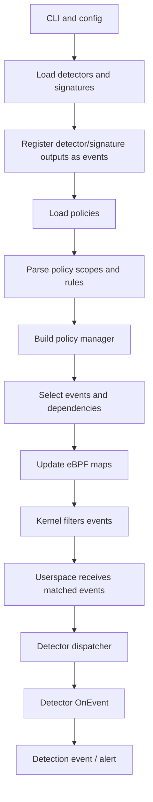

# Tracee Detectors And Policies Runtime Workflow

This document explains, in a narrative way, how Tracee connects policies,
detectors, event selection, eBPF filtering and runtime detection. The goal is
not to describe every line of code, but to make the execution flow understandable
enough to reuse the same ideas in our tool.

The most important distinction is this:

```text
Policy   = what Tracee should observe and enable.
Detector = what Tracee should understand and report as suspicious.
```

Policies define the perimeter. Detectors define the meaning.

## Basic Definitions

### Event

An event is a structured fact produced by Tracee.

It can come directly from the kernel, for example:

```text
execve
open
security_file_open
security_task_kill
```

Or it can be produced by a detector, for example:

```text
suspicious_shell_execution
fileless_execution
kernel_module_loading
```

This is important: in Tracee, detector outputs are also represented as events.
That means the same policy system can select both kernel events and detection
events.

### Policy

A policy defines what Tracee should monitor.

It can contain:

- scope filters, such as `uid`, `pid`, `comm`, container, namespace or binary
  filters;
- event rules, such as `execve`, `open`, or detector-produced events;
- argument filters, such as path, return value or event data filters.

Conceptually, a policy answers questions like:

```text
Which events should be enabled?
For which processes, users or containers?
Which detector events should be emitted?
Which filters can be pushed into eBPF?
```

A policy does not create new detector logic. It only selects and enables logic
that already exists.

For example, if a detector called `suspicious_shell_execution` exists, a policy
can enable it:

```yaml
rules:
  - event: suspicious_shell_execution
```

The policy is not defining how suspicious shell execution is detected. It only
says that this detector output is relevant.

### Detector

A detector is a detection module.

It receives events, applies logic, and may produce a new detection event.

In simple terms:

```text
input event -> detector logic -> output detection event
```

For example:

```text
input:  execve /bin/bash
logic:  shell started by suspicious parent
output: suspicious_shell_execution
```

In Tracee, detectors implement this interface:

```go
type EventDetector interface {
    GetDefinition()
    Init()
    OnEvent()
}
```

The detector declares:

- which event it produces;
- which input events it needs;
- whether it has threat metadata;
- what fields should be auto-populated in the output.

### YAML Detector

A YAML detector is a detector described in a YAML file instead of Go code.

This is very useful because it allows users to add detection logic without
rebuilding the Tracee binary.

A YAML detector usually defines:

- an ID;
- the event it produces;
- required input events;
- conditions;
- output fields;
- optional threat metadata.

Tracee parses this YAML, validates it, compiles the conditions, and wraps it in
a runtime detector object.

### Signature

Signatures are Tracee's older detection model.

They are conceptually similar to detectors: they receive events and produce
findings. However, they belong to a legacy engine and use a different interface.

For our project, signatures are useful to study historically, but the modern and
cleaner direction is the detector model, especially YAML detectors.

### Threat Metadata

Detector outputs can include threat metadata.

This metadata can describe:

- severity;
- threat name;
- MITRE ATT&CK tactic;
- MITRE ATT&CK technique.

Policies can use this metadata to select detectors semantically.

For example:

```text
threat.severity=critical
threat.mitre.technique=T1055
```

This means the policy does not need to name each detector manually. Tracee scans
the existing detectors and enables the ones matching the threat criteria.

### Matched Policies Bitmap

Tracee represents policy matches with a bitmap.

Each policy gets an ID. Each ID corresponds to one bit in a `uint64`.

Example:

```text
matched_policies = 00000101
```

This means:

```text
policy 0 matched
policy 2 matched
```

This is why Tracee has a limit of 64 policies in this model.

The bitmap is important because it lets the kernel and userspace cheaply carry
policy matching information together with each event.

## High-Level Workflow

At a high level, the runtime workflow is:



The rest of the document explains each jump in this pipeline.

## 1. CLI And Main Runtime Wiring

The central file is:

```text
tracee/pkg/cmd/cobra/cobra.go
```

This file is where Tracee assembles the runtime configuration. It reads CLI
flags and configuration values, then prepares signatures, detectors, policies,
buffers, enrichment, stores and output-related settings.

Important operations in this file include:

```go
signature.Find(...)
sigs.CreateEventsFromSignatures(...)
flags.PrepareDetectors(...)
detectors.CollectAllDetectors(...)
detectors.CreateEventsFromDetectors(...)
createPoliciesFromPolicyFiles(...)
createPoliciesFromCLIFlags(...)
createPoliciesFromK8SPolicy(...)
selectSignaturesBasedOnPolicies(...)
```

The important idea is that Tracee prepares detectors before final policy
selection. This matters because detector-produced events must exist before a
policy can select them.

## 2. Loading Signatures

Tracee loads legacy signatures with:

```go
signature.Find(...)
```

Relevant file:

```text
tracee/pkg/signatures/signature/signature.go
```

After loading signatures, Tracee calls:

```go
sigs.CreateEventsFromSignatures(...)
```

This creates event definitions for signatures. In practice, it allows a
signature finding to behave like a normal event in the event registry.

For our tool, this is less important than detectors, but the idea is useful:
derived detections should be first-class events.

## 3. Loading YAML Detectors

Tracee prepares detector paths with:

```go
flags.PrepareDetectors(...)
```

Relevant file:

```text
tracee/pkg/cmd/flags/detectors.go
```

This function reads detector-related flags and returns the directories where
YAML detectors should be searched.

Then Tracee collects detectors with:

```go
detectors.CollectAllDetectors(...)
```

The collected detectors are then registered as events with:

```go
detectors.CreateEventsFromDetectors(...)
```

Relevant file:

```text
tracee/pkg/detectors/events.go
```

This step is crucial. It means every detector output gets an event ID. Without
this event ID, policies could not select detector outputs.

## 4. Parsing YAML Detectors

The YAML detector implementation is mainly in:

```text
tracee/pkg/detectors/yaml/schema.go
tracee/pkg/detectors/yaml/parser.go
tracee/pkg/detectors/yaml/loader.go
tracee/pkg/detectors/yaml/list_loader.go
tracee/pkg/detectors/yaml/detector.go
```

The typical path is:

```text
list_loader.go
  -> loader.go
    -> parser.go
      -> schema.go
      -> detector.go
```

`schema.go` defines the shape of a YAML detector.

`parser.go` reads YAML from disk and converts it into internal Go structures.
Important functions are:

```go
ParseFile(...)
ToDetectorDefinition(...)
parseRequirements(...)
parseEventRequirement(...)
parseThreat(...)
```

`detector.go` creates the runtime detector object. Important functions are:

```go
NewDetector(...)
GetDefinition(...)
Init(...)
compileCELPrograms(...)
OnEvent(...)
```

The important method is:

```go
OnEvent(...)
```

This is called every time the detector receives an input event. It evaluates
conditions and returns zero or more detection outputs.

## 5. Detector Interface

The detector interface is defined in:

```text
tracee/api/v1beta1/detection/detector.go
```

Important types:

```go
type EventDetector interface
type DetectorDefinition struct
type DetectorRequirements struct
type EventRequirement struct
type DetectorOutput struct
type DetectorParams struct
```

This file tells us what a detector is expected to provide.

The detector definition says:

```text
I produce this event.
I require these input events.
I may have this threat metadata.
I may need these datastores or enrichments.
```

This is the contract we should imitate in our tool, even if we implement a
simpler first version.

## 6. Loading Policies

Tracee can create policies from different sources.

Relevant file:

```text
tracee/pkg/cmd/cobra/helper.go
```

Important functions:

```go
createPoliciesFromK8SPolicy(...)
createPoliciesFromPolicyFiles(...)
createPoliciesFromCLIFlags(...)
```

These functions are simple adapters. They accept different input sources but
convert everything into the same internal policy model.

For example, policy files are loaded with:

```go
v1beta1.PoliciesFromPaths(...)
```

Relevant file:

```text
tracee/pkg/policy/v1beta1/policy_file.go
```

After that, all paths converge into:

```go
flags.PrepareFilterMapsFromPolicies(...)
flags.CreatePolicies(...)
```

## 7. Converting Policy Text Into Policy Objects

The main file here is:

```text
tracee/pkg/cmd/flags/policy.go
```

Important functions:

```go
PrepareFilterMapsFromPolicies(...)
CreatePolicies(...)
createSinglePolicy(...)
parseScopeFilters(...)
parseEventFilters(...)
expandThreatPattern(...)
matchesThreatCriteria(...)
```

`PrepareFilterMapsFromPolicies(...)` reads policy scope and rules and converts
them into intermediate maps.

`CreatePolicies(...)` turns those maps into actual `policy.Policy` objects.

`createSinglePolicy(...)` creates one policy and calls:

```go
parseScopeFilters(...)
parseEventFilters(...)
```

`parseScopeFilters(...)` handles filters such as:

```text
uid
pid
comm
container
mntns
pidns
binary
process tree
```

`parseEventFilters(...)` handles event selection and event-specific filters.
This is where Tracee decides which event IDs belong to the policy.

## 8. How Policies Select Detectors

Detector correlation with policies happens inside:

```go
parseEventFilters(...)
expandThreatPattern(...)
```

There are two main cases.

### Case 1: Policy Selects A Detector Event By Name

If a detector produces an event called:

```text
suspicious_shell_execution
```

a policy can select it directly:

```yaml
rules:
  - event: suspicious_shell_execution
```

This works only because detector events were already registered in the event
registry before policies were parsed.

### Case 2: Policy Selects Detectors By Threat Metadata

Policies can also select detectors semantically.

For example:

```text
threat.severity=critical
threat.mitre.technique=T1055
```

This is handled by:

```go
expandThreatPattern(...)
```

The function scans all existing detectors, calls:

```go
detector.GetDefinition()
```

and checks the detector's threat metadata.

If the metadata matches, the detector's produced event is added to the policy.

So the policy does not create detectors. It selects existing detectors.

## 9. Policy Struct

The internal policy object is defined in:

```text
tracee/pkg/policy/policy.go
```

Important structures:

```go
type Policy struct
type RuleData struct
```

The `Policy` struct contains scope filters and event rules.

Simplified:

```go
type Policy struct {
    ID      int
    Name    string
    UIDFilter
    PIDFilter
    CommFilter
    BinaryFilter
    ProcessTreeFilter
    Rules map[events.ID]RuleData
}
```

The `Rules` map is very important:

```text
event ID -> filters for that event
```

This is the internal representation of what the policy wants to observe.

## 10. Policies Collection

Policies are stored in:

```text
tracee/pkg/policy/policies.go
```

Important functions:

```go
NewPolicies(...)
set(...)
add(...)
remove(...)
lookupById(...)
lookupByName(...)
```

The `policies` struct stores policies by ID and by name. It also keeps a fixed
array of up to 64 policies, because policy matches are represented as a `uint64`
bitmap.

This is where the 64-policy limit comes from.

## 11. Policy Manager

The policy manager is defined in:

```text
tracee/pkg/policy/policy_manager.go
```

Important function:

```go
NewManager(...)
```

When the manager is created, it calls:

```go
initialize(...)
```

Then `initialize(...)` calls:

```go
subscribeDependencyHandlers(...)
selectMandatoryEvents(...)
selectConfiguredEvents(...)
selectUserEvents(...)
updateCapsForSelectedEvents(...)
```

The most important one is:

```go
selectUserEvents(...)
```

This function scans every policy and every event rule inside each policy. It
builds an internal rule map that says:

```text
event A should be submitted for policy X
event A should be emitted for policy X
event B should be submitted for policy Y
```

In simplified form:

```text
eventID -> policy bitmap
```

This is the bridge between policy configuration and event selection.

## 12. Dependencies

Some events require other events to work correctly.

For example, a detector might need process lifecycle events even if the user did
not explicitly request them.

The manager handles this through:

```go
subscribeDependencyHandlers(...)
addDependencyEventToRules(...)
addDependenciesToRulesRecursive(...)
selectEvent(...)
```

This prevents policies from accidentally disabling internal events needed by
detectors, process tree tracking or enrichment.

## 13. Updating eBPF Maps

The policy-to-eBPF translation happens in:

```text
tracee/pkg/policy/ebpf.go
```

Important function:

```go
updateBPF(...)
```

This function computes all filter equalities and writes them into BPF maps.

Important helper functions:

```go
createNewEventsMapVersion(...)
createNewFilterMapsVersion(...)
createNewDataFilterMapsVersion(...)
updateUIntFilterBPF(...)
updateStringFilterBPF(...)
updateStringDataFilterLPMBPF(...)
updateStringDataFilterBPF(...)
updateBinaryFilterBPF(...)
populateProcInfoMap(...)
createNewPoliciesConfigMap(...)
computePoliciesConfig(...)
PoliciesConfig.UpdateBPF(...)
```

This stage translates Go policy objects into kernel-readable maps.

Examples of eBPF maps involved:

```text
events_map_version
uid_filter_version
pid_filter_version
comm_filter_version
binary_filter_version
data_filter_prefix_version
data_filter_suffix_version
data_filter_exact_version
policies_config_version
```

The result is that the kernel can evaluate many filters before sending events
to userspace.

## 14. Kernel-Side Policy Evaluation

The kernel-side logic lives mainly in:

```text
tracee/pkg/ebpf/c/common/context.h
tracee/pkg/ebpf/c/common/filtering.h
tracee/pkg/ebpf/c/maps.h
```

Important functions in `context.h`:

```c
get_event_config(...)
init_program_data(...)
```

Important functions in `filtering.h`:

```c
match_scope_filters(...)
match_data_filters(...)
evaluate_scope_filters(...)
evaluate_data_filters(...)
policies_matched(...)
event_is_selected(...)
```

The kernel-side event flow is:

```text
kernel hook fires
-> program data is initialized
-> event config is loaded from BPF maps
-> matched_policies starts as policies interested in that event
-> scope filters reduce matched_policies
-> data filters reduce matched_policies
-> if matched_policies is not zero, event is submitted
```

This means the kernel does not simply answer "match or no match". It keeps track
of exactly which policies matched.

## 15. Userspace Policy Checks

After an event reaches userspace, the policy manager can still be used to decide
how the event should flow.

Important functions:

```go
IsEnabled(...)
IsRuleEnabled(...)
IsEventEnabled(...)
MatchEvent(...)
MatchEventInAnyPolicy(...)
EventsSelected(...)
EventsToSubmit(...)
IsEventToEmit(...)
IsEventToSubmit(...)
CreateUserlandIterator(...)
CreateAllIterator(...)
```

These functions answer questions like:

```text
Is this event enabled?
Should this event be emitted?
Does this event belong to any policy?
Is this event required only as an internal dependency?
```

This is useful because not all filtering is kernel-side. Some decisions remain
in userspace, especially when data is not easy or cheap to evaluate in eBPF.

## 16. Detector Engine

The detector engine is defined in:

```text
tracee/pkg/detectors/engine.go
tracee/pkg/detectors/registry.go
tracee/pkg/detectors/dispatch.go
```

`engine.go` creates the detector engine:

```go
NewEngine(...)
RegisterDetector(...)
DispatchToDetectors(...)
```

`registry.go` stores detectors and validates them.

`dispatch.go` decides which detector should receive which input event.

The key method in `dispatch.go` is:

```go
rebuild(...)
```

This rebuilds the dispatch map.

The important line conceptually is:

```go
policyManager.IsEventSelected(detectorEntry.eventID)
```

This means a detector is only added to the dispatch map if its output event is
selected by policy.

So policies control detector activation.

## 17. Detector Dispatch Runtime

At runtime, Tracee calls:

```go
dispatchToDetectors(...)
```

The logic is:

```text
receive input event
look up detectors subscribed to that event ID
skip disabled detectors
apply detector-specific filters
call detector.OnEvent(...)
convert DetectorOutput into a full event
return produced detection events
```

The function that builds the final output event is:

```go
buildEventFromOutput(...)
```

This copies useful context from the input event and adds the detector output
data.

## 18. Complete Runtime Story

Putting everything together:

1. Tracee starts from CLI/config.
2. It loads Go signatures.
3. It loads YAML detectors.
4. It registers signature and detector outputs as events.
5. It reads policies from CLI, files or Kubernetes.
6. It parses policy scopes and event rules.
7. If a policy uses `threat.*`, it expands that into matching detector events.
8. It creates internal `Policy` objects.
9. It builds a `Policy Manager`.
10. The manager selects mandatory, configured and user-requested events.
11. It computes dependencies.
12. It writes event selection and filter information into eBPF maps.
13. eBPF programs use these maps to evaluate scope and data filters.
14. Matching events are sent to userspace with `matched_policies`.
15. Userspace receives and decodes the event.
16. If detector output events are selected by policy, the detector dispatcher
    routes matching input events to those detectors.
17. Detectors evaluate their logic.
18. If detection succeeds, a new detection event is produced.
19. The output layer prints normal events and detection events.

## Policies And Detectors: Final Relationship

The relationship can be summarized like this:

```text
Detector defines detection logic.
Policy decides whether that detection logic is active.
```

More precisely:

```text
Detector:
  "I detect suspicious shell execution."

Policy:
  "I want suspicious shell execution detections for this scope."
```

Or:

```text
Detector:
  "I produce an event with severity critical."

Policy:
  "Enable all critical threat detections."
```

The policy does not create the detector. The detector must already exist.

The policy selects the detector's produced event. Once that output event is
selected, the dispatcher starts feeding the detector with the input events it
declared in its requirements.

This is the key design lesson for our project:

```text
Policies should decide what is active.
Detectors should decide what is suspicious.
The runtime should connect them through event IDs.
```

## Minimal Version For Our Tool

For our project, we do not need to copy the entire Tracee policy system at once.
A clean first version could be:

```text
1. Load detector YAML files.
2. Register detector names internally.
3. Load a simple policy YAML.
4. Use the policy to select base events and detector outputs.
5. Dispatch decoded events to selected detectors in userspace.
6. Emit alerts separately from normal events.
```

Only later should we add kernel-side policy maps.

This gives us a practical evolution path:

```text
phase 1: userspace policies and detector engine
phase 2: detector correlations and contextual state
phase 3: kernel-side filtering for high-volume events
```

That order keeps the implementation understandable while still moving the tool
toward a serious runtime detection system.
