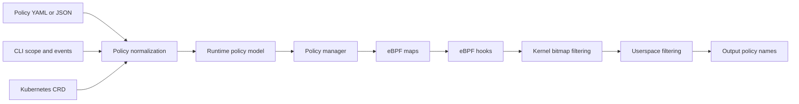
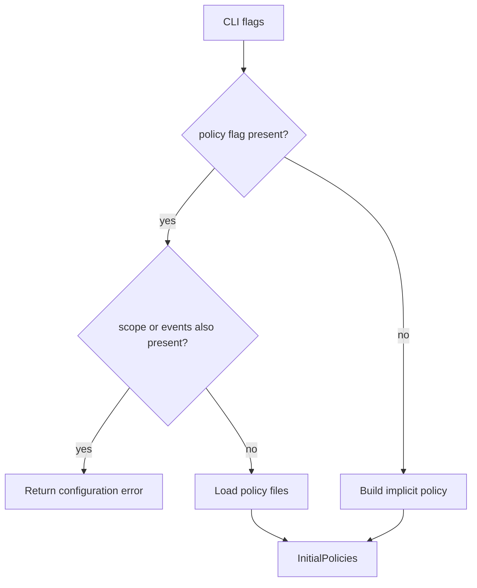
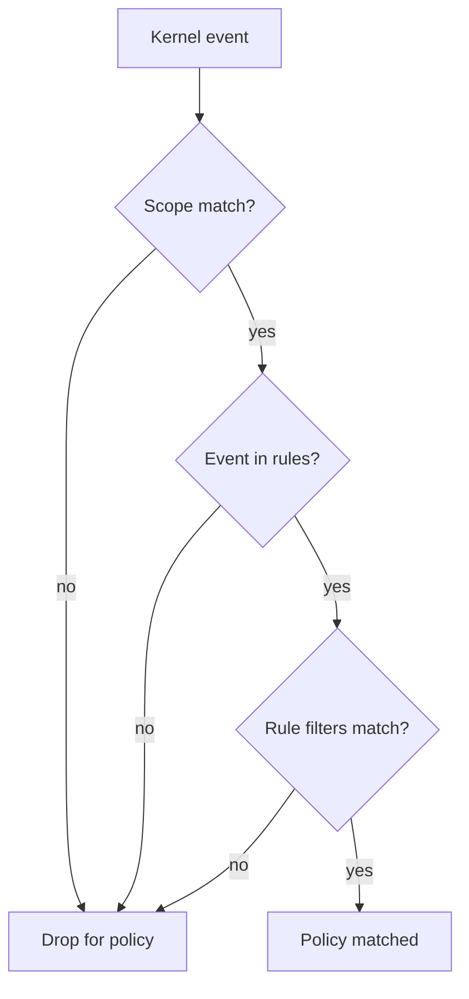
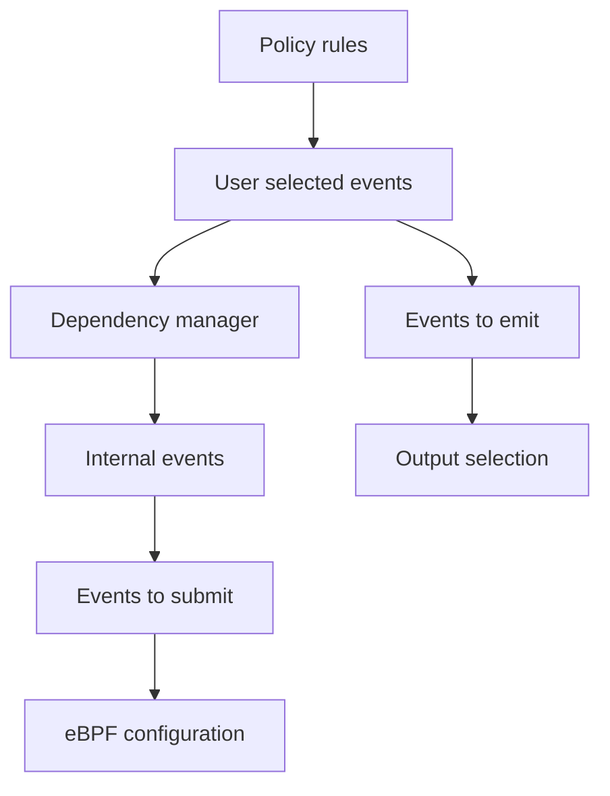
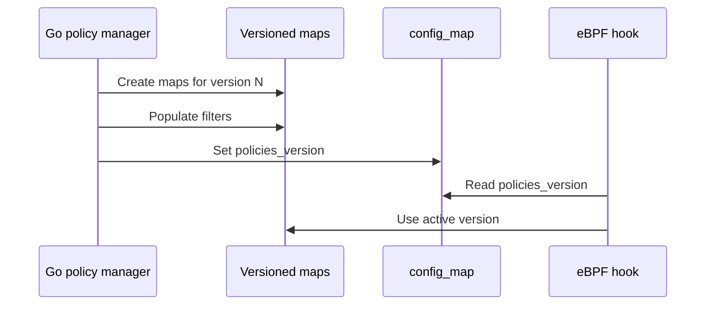
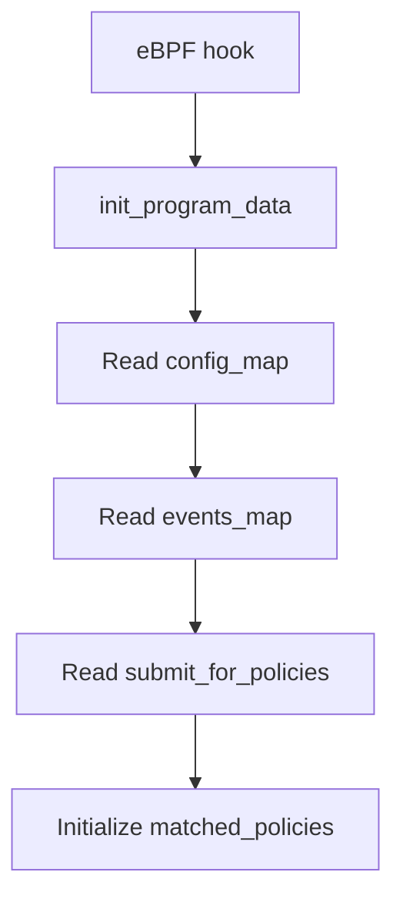
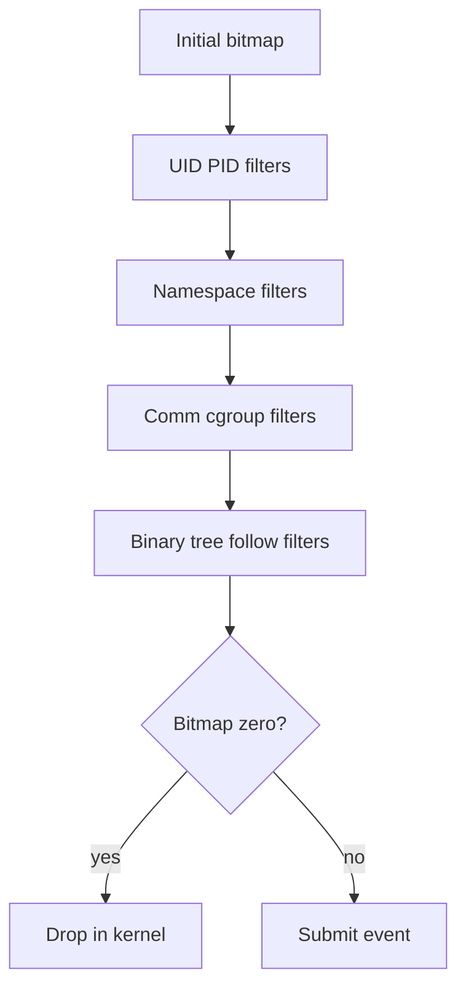
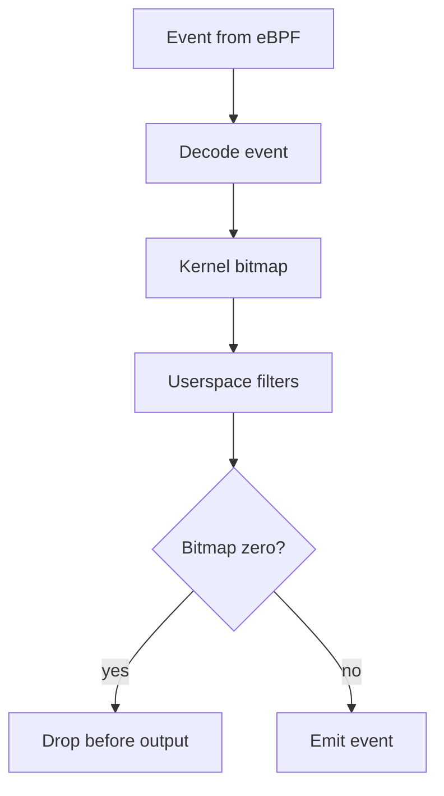

# Tracee Policy Engine

Questo report spiega come Tracee implementa il sistema di policy e quali parti
conviene riusare nel nostro tool. L'obiettivo e' seguire la pipeline completa:
input utente, modello runtime, configurazione eBPF, filtro nel kernel, filtro in
userspace e output finale.

La versione e' volutamente compatta: resta un report tecnico, ma senza ripetere
tutti i dettagli del codice.

## Fonti

Documentazione ufficiale Tracee v0.24:

- Policy overview: <https://aquasecurity.github.io/tracee/v0.24/docs/policies/>
- Policy CLI usage: <https://aquasecurity.github.io/tracee/v0.24/docs/policies/usage/cli/>
- Scope filters: <https://aquasecurity.github.io/tracee/v0.24/docs/policies/scopes/>
- Rule filters: <https://aquasecurity.github.io/tracee/v0.24/docs/policies/rules/>
- Troubleshooting: <https://aquasecurity.github.io/tracee/v0.24/docs/troubleshooting/>

File locali principali:

- `tracee/pkg/policy/v1beta1/policy_file.go`
- `tracee/pkg/cmd/cobra/helper.go`
- `tracee/pkg/cmd/cobra/cobra.go`
- `tracee/pkg/cmd/flags/policy.go`
- `tracee/pkg/cmd/flags/scope.go`
- `tracee/pkg/cmd/flags/event.go`
- `tracee/pkg/policy/policy.go`
- `tracee/pkg/policy/policies.go`
- `tracee/pkg/policy/policy_manager.go`
- `tracee/pkg/policy/ebpf.go`
- `tracee/pkg/ebpf/events_pipeline.go`
- `tracee/pkg/ebpf/c/common/context.h`
- `tracee/pkg/ebpf/c/common/filtering.h`
- `tracee/pkg/ebpf/c/maps.h`
- `tracee/pkg/ebpf/c/types.h`
- `tracee/types/trace/trace.go`

## Executive Summary

In Tracee una policy definisce quali workload monitorare, quali eventi abilitare
e quali filtri applicare prima dell'output.

La scelta piu' importante e' il bitmap di policy. Ogni policy riceve un ID e
quell'ID diventa una posizione dentro un `uint64`.

```text
policy 0 -> bit 0
policy 1 -> bit 1
policy 2 -> bit 2

matched_policies = 0b00000101
```

In questo esempio matchano policy 0 e policy 2. Il limite naturale e' 64 policy,
perche' il bitmap e' un `uint64`.

Il kernel lavora con il bitmap. Userspace lo converte in nomi leggibili:

```json
"matchedPolicies": ["sensitive-files", "container-runtime"]
```

Questa e' la parte piu' interessante per noi: il motore non ragiona con un solo
booleano, ma con un insieme compatto di policy candidate e policy matchate.

## Pipeline generale



Tracee separa bene:

- formato esterno;
- parsing e validazione;
- modello runtime;
- configurazione eBPF;
- filtro kernel-side;
- filtro userspace;
- output.

Questa separazione e' piu' importante della singola implementazione. E' il punto
da copiare nel nostro progetto.

## Formato policy

Tracee supporta un formato Kubernetes CRD e un formato plain. Per il nostro tool
il formato plain e' quello piu' utile.

```yaml
type: policy
name: overview-policy
description: sample overview policy
scope:
  - global
rules:
  - event: execve
  - event: security_file_open
    filters:
      - data.pathname=/tmp/*
```

Il file `tracee/pkg/policy/v1beta1/policy_file.go` definisce i formati e la
validazione. I controlli principali riguardano nome, descrizione, scope, rules,
evento esistente e filtri supportati.

La stessa policy non dovrebbe dichiarare due volte lo stesso evento. Il codice
locale mantiene una mappa degli eventi gia' visti durante la validazione.

## CLI e normalizzazione

Tracee permette di caricare una policy da file, directory o piu' file:

```bash
tracee --policy ./policy.yml
tracee --policy ./policies/
tracee --policy ./one.yaml --policy ./two.yaml
```

Regola importante:

- se usi `--policy`, non puoi usare anche `--scope` o `--events`;
- se non usi `--policy`, Tracee costruisce una policy implicita dai flag.

Il motivo e' evitare ambiguita'. Una policy contiene gia' scope ed eventi, quindi
mescolarla con flag manuali rende meno chiaro quale filtro prevale.



File coinvolti:

- `tracee/pkg/cmd/cobra/cobra.go`: decide quali input usare;
- `tracee/pkg/cmd/cobra/helper.go`: normalizza CRD, file e CLI;
- `tracee/pkg/cmd/flags/policy.go`: crea le policy runtime;
- `tracee/pkg/cmd/flags/event.go`: interpreta eventi e filtri.

## Scope e rules

Lo `scope` limita il workload osservato:

```yaml
scope:
  - uid=1000
  - comm=bash
```

Le `rules` definiscono quali eventi tracciare e con quali filtri:

```yaml
rules:
  - event: execve
  - event: security_file_open
    filters:
      - data.pathname=/etc/*
```

La differenza e' questa:

- lo scope vale per tutta la policy;
- i filtri dentro una rule valgono solo per quell'evento.

Quindi una policy viene valutata come:

```text
policy match =
    scope match
    AND event present in rules
    AND optional rule filters match
```



## Modello runtime

Il modello runtime principale e' `policy.Policy`, in
`tracee/pkg/policy/policy.go`.

Contiene:

- `ID`;
- `Name`;
- filtri globali;
- `Rules`;
- flag `Follow`.

Ogni rule usa `RuleData`, che contiene:

- evento;
- filtro di scope locale;
- filtro sugli argomenti;
- filtro sul return value.

Questa divisione spiega la struttura generale:

```text
Policy
  scope filters
  rules
    event A
      data filters
      retval filters
    event B
      data filters
```

## Policy Manager

Il `policy.Manager`, in `tracee/pkg/policy/policy_manager.go`, tiene insieme il
sistema.

Responsabilita':

- mantiene le policy;
- assegna e gestisce gli ID;
- seleziona gli eventi richiesti;
- aggiunge eventi necessari come dipendenze;
- distingue eventi da sottomettere da eventi da emettere;
- aggiorna le mappe eBPF;
- fornisce le policy alla pipeline userspace.

Distinzione importante:

- evento selezionato: richiesto dall'utente;
- evento da sottomettere: necessario al motore interno;
- evento da emettere: da mostrare in output.



Questo e' utile anche per noi: alcuni hook possono servire a costruire contesto
senza dover essere sempre stampati.

## Mappe eBPF

Tracee traduce le policy in mappe eBPF in `tracee/pkg/policy/ebpf.go`.

Le mappe principali riguardano:

- filtri su `uid`;
- filtri su `pid`;
- filtri su namespace;
- filtri su `comm`;
- filtri su cgroup;
- filtri su process tree;
- filtri su path binario;
- filtri su argomenti evento;
- configurazione degli eventi.

Tracee usa anche mappe versionate, ad esempio `uid_filter_version`,
`comm_filter_version`, `events_map_version` e `policies_config_version`.

Questo permette di preparare una nuova versione delle policy e poi aggiornare la
versione corrente nella `config_map`.



Per il nostro tool non conviene partire da qui. Le mappe versionate hanno senso
quando serve aggiornare policy a runtime. Per una prima versione e' sufficiente
caricare le policy all'avvio.

## `events_map` e bitmap iniziale

La mappa piu' importante e' `events_map`. Per ogni evento contiene il bitmap
delle policy che richiedono quell'evento.

Esempio:

```text
execve richiesto da policy 0 e policy 2
submit_for_policies = 0b00000101
```

Quando un hook inizializza l'evento, `init_program_data` legge questa
configurazione e inizializza `matched_policies`.



Da quel momento i filtri non aggiungono policy: rimuovono bit quando una policy
non matcha.

## Kernel-side filtering

Il filtro nel kernel e' implementato principalmente in
`tracee/pkg/ebpf/c/common/filtering.h`.

La funzione centrale e':

```c
match_scope_filters(program_data_t *p)
```

Tracee valuta filtri su:

- container;
- pid;
- uid;
- mount namespace;
- pid namespace;
- uts namespace;
- comm;
- cgroup;
- process tree;
- binary path;
- follow.

Il risultato viene mascherato con le policy abilitate. Se il bitmap diventa zero,
l'evento viene scartato nel kernel.



Questa e' la prima ottimizzazione reale per ridurre rumore e CPU: evitare che
eventi non interessanti arrivino in userspace.

## Equality map

Un dettaglio molto interessante e' la struttura `eq_t`.

Tracee non salva solo:

```text
comm=bash -> policy 1
```

Salva due bitmap:

- `equals_in_policies`;
- `key_used_in_policies`.

Questo serve per gestire sia `=` sia `!=`.

Esempio:

```text
policy 1: comm=bash
policy 2: comm!=bash

key bash:
  equals_in_policies = bit policy 1
  key_used_in_policies = bit policy 1 + bit policy 2
```

Con una sola lookup Tracee capisce quali policy matchano e quali policy usano
quella chiave in modo negativo. E' una soluzione compatta e molto efficiente.

## Data filtering

Tracee supporta filtri sugli argomenti evento:

```yaml
rules:
  - event: security_file_open
    filters:
      - data.pathname=/tmp*
```

La funzione kernel-side e':

```c
match_data_filters(program_data_t *p, u8 index)
```

Usa tre famiglie di mappe:

- exact match;
- prefix match;
- suffix match.

I filtri prefix e suffix usano LPM trie. Per noi questa parte e' utile sugli
eventi file-related, perche' pathname come `/etc/`, `/proc/`, `/tmp/` generano
molto rumore e sono candidati naturali per filtro kernel-side.

## Userland filtering

Non tutto viene filtrato nel kernel. In `tracee/pkg/ebpf/events_pipeline.go`,
Tracee usa:

```go
matchPolicies(event *events.PipelineEvent)
```

Questa fase applica filtri piu' comodi in Go:

- range UID/PID;
- return value;
- filtri su argomenti gia' decodificati;
- filtri di scope piu' complessi.



Il motivo della doppia fase e' pragmatico:

- il kernel scarta presto gli eventi facili;
- userspace gestisce logiche ricche senza stressare il verifier eBPF.

## Output

L'evento pubblico Tracee espone:

```go
MatchedPolicies []string
```

Il bitmap resta interno. L'utente vede nomi di policy:

```json
{
  "eventName": "security_file_open",
  "matchedPolicies": ["sensitive-files"]
}
```

Per il nostro tool e' una buona regola: non esporre dettagli interni del motore
policy, ma nomi leggibili.

## Performance

La documentazione ufficiale di troubleshooting collega direttamente policy e
performance.

Se non arrivano eventi, spesso lo scope e' troppo stretto. Se CPU e volume eventi
sono alti, la soluzione consigliata e' restringere lo scope o applicare filtri
specifici.

Per il nostro tool questo e' centrale. Hook come `open`, `chmod`, `chown`,
`execve` e `security_file_open` possono produrre molto rumore. Una policy come
questa ridurrebbe gli eventi prima dell'output:

```yaml
type: policy
name: sensitive-file-access
description: monitor selected file accesses
scope:
  - comm=cat
rules:
  - event: open
    filters:
      - data.pathname=/etc/*
```

## Cosa importare nel nostro tool

Non conviene copiare tutto Tracee subito. Conviene importare il design per fasi.

### Fase 1: policy file userspace-only

Supportare:

```bash
sudo ./dist/project --policy ./policy.yaml
```

Formato iniziale:

```yaml
type: policy
name: demo-policy
description: first local policy
scope:
  - global
rules:
  - event: execve
  - event: open
    filters:
      - data.pathname=/etc/*
```

Implementazione:

- parser YAML;
- validazione eventi;
- conversione verso la configurazione attuale;
- filtro in userspace dopo il decoder.

### Fase 2: filtro kernel-side minimo

Portare nel kernel solo i filtri economici:

- evento abilitato;
- `comm`;
- `uid`;
- `pid`.

Questa fase riduce rumore e CPU senza introdurre subito mappe versionate.

### Fase 3: filtro pathname nel kernel

Portare nel kernel `data.pathname` per:

- `open`;
- `chmod`;
- `chown`;
- `security_file_open`;
- futuri hook come unlink, rename e mount.

### Fase 4: bitmap multi-policy

Quando serviranno piu' policy contemporaneamente, introdurre:

```text
matched_policies uint64
```

Servono ID policy, bitmap nell'evento interno e conversione in nomi policy lato
output.

### Fase 5: mappe versionate

Solo se servono reload dinamici o aggiornamento policy a runtime.

## Mini formato consigliato

Per il nostro progetto conviene partire compatibili con il formato plain di
Tracee, ma con un sottoinsieme controllato:

```yaml
type: policy
name: suspicious-process-access
description: monitor selected process and file activity
scope:
  - comm=bash
rules:
  - event: execve
  - event: open
    filters:
      - data.pathname=/etc/*
  - event: security_task_kill
    filters:
      - data.target_comm=sshd
```

Campi iniziali:

```text
scope:
  global
  comm=<value>
  uid=<value>
  pid=<value>

filters:
  data.<arg>=<value>
  data.<arg>!=<value>
  retval=<number>
  retval!=<number>
```

## Regole architetturali

1. Non mischiare `--policy` con `--events`, `--drop-events` e `--comms` nella
   prima implementazione.

2. Tenere separati parsing YAML, modello runtime, filtro userspace e filtro
   kernel-side.

3. Non partire dalle mappe versionate.

4. Usare gli hook gia' implementati come base per le rules.

5. Per i filtri su argomenti, partire da `pathname`, `filename`, `target_comm` e
   `comm`.

6. Per performance, filtrare prima evento, poi `comm`/`uid`/`pid`, poi pathname.

## Takeaway

La feature di policy di Tracee e' un control plane completo:

```text
policy file, CLI or Kubernetes
    -> runtime Policy
    -> policy manager
    -> event dependency selection
    -> eBPF maps
    -> kernel bitmap matching
    -> userspace filtering
    -> output with matched policy names
```

Per il nostro progetto, la strada piu' solida e':

1. policy YAML semplice;
2. filtro userspace;
3. filtro kernel-side minimo;
4. bitmap multi-policy;
5. mappe versionate solo se servono reload dinamici.
